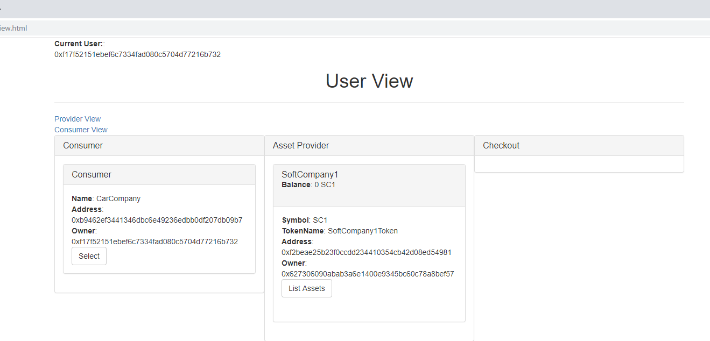
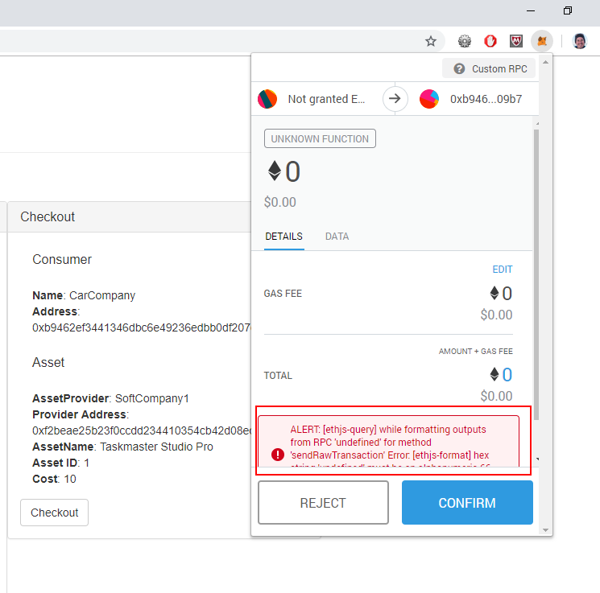

# Luzon

*Author*
Moritz Armingeon, [moritz.armingeon@students.fhnw.ch](mailto:moritz.armingeon@students.fhnw.ch)

Luzon is a TaaL (Token-as-a-License) implementation. This prototype is a floating license system as decentralised application. I built Luzon within a Master Thesis Project. The report is available upon request.

Taal is the name of a volcano on the Philippine island Luzon.

# Prerequisites
* Node.js [Link](https://nodejs.org/)
* Truffle (npm install truffle -g) [Link](https://truffleframework.com/)
* Ganache [Link](https://truffleframework.com/ganache)
* Browser with Metamask [Link](https://metamask.io/)

# Deployment

1. Install dependencies
`npm install`

1. Compile contracts
`truffle compile`

1. Migrate contracts
`truffle migrate`

1. Run tests
`truffle test`

1. Start Node Server
`npm run dev`

# Step by Step Guide

## Step 1 - Open ProviderView

| **Details** |
| ------------------ | 
| **User:** AssetProvider|
| **Result:** No Providers deployed yet. |
|  |

## Step 2 - Create a new Provider (SoftCompany1, Symbol SC1)

| **Details** |
| ------------------ | 
| **User:** AssetProvider|
| **Result:** Confirm-Transactiondialog appears. |
|  |

## Step 3 - Show deployed Providers

| **Details** |
| ------------------ | 
| **User:** AssetProvider|
| **Result:** Newly created SoftCompany1 appears. |
|  |

## Step 4 -	Add a software asset (Taskmaster Studio Pro, 10 SC1)

| **Details** |
| ------------------ | 
| **User:** AssetProvider|
| **Result:** Confirm-Transaction dialog appears. |
|  |

## Step 5 - Show ProviderView, List Assets

| **Details** |
| ------------------ | 
| **User:** AssetProvider|
| **Result:** Newly created Taskmaster Studio Pro appears. |
|  |

## Step 6 - Change Account

| **Details** |
| ------------------ | 
| **User:** AssetProvider -> AssetConsumer |
| **Result:** AssetConsumer takes over. |
|  |

## Step 7 - Show Consumer View, Create new Company (CarCompany)

| **Details** |
| ------------------ | 
| **User:** AssetConsumer|
| **Result:** Confirm-Transaction dialog appears. |
|  |

## Step 8 - Show Consumer View

| **Details** |
| ------------------ | 
| **User:** AssetConsumer|
| **Result:** Newly created CarCompany appears. |
|  |

## Step 9 - Switch to ProviderView

| **Details** |
| ------------------ | 
| **User:** AssetConsumer|
| **Result:** ProviderView appears. |
|  |

## Step 10 - Buy Tokens from SoftCompany1. Target address is the contract address of CarCompany

| **Details** |
| ------------------ | 
| **User:** AssetConsumer|
| **Result:** Confirm Transaction dialog appears. |
|  |

## Step 11 - Switch to ConsumerView. Add EndUser to the trusted Users

| **Details** |
| ------------------ | 
| **User:** AssetConsumer|
| **Result:** Confirm Transaction dialog appears. |
|  |

## Step 12 - Show ConsumerView

| **Details** |
| ------------------ | 
| **User:** AssetConsumer|
| **Result:** Newly added EndUser is part of the users. |
|  |

## Step 13 - Switch User to EndUser, Open UserView

| **Details** |
| ------------------ | 
| **User:** AssetConsumer -> EndUser |
| **Result:** EndUser takes over. |
|  |

## Step 14 - Select CarCompany and Softcompany (Taskmaster Studio Pro), click checkout

| **Details** |
| ------------------ | 
| **User:** EndUser|
| **Result:** Confirm Transaction dialog appears, TestApp (Taskmaster Studio Pro) opens. |
|  |

## Step 15 - Use Taskmaster Studio Pro, click Return 

| **Details** |
| ------------------ | 
| **User:** EndUser|
| **Result:** Confirm Transaction dialog appears, TestApp (Taskmaster Studio Pro) opens. |
|  |

## Step 16 - Test checkout with invalid user

| **Details** |
| ------------------ | 
| **User:** Invalid User|
| **Result:** Checkout is not possible. |
|  |
